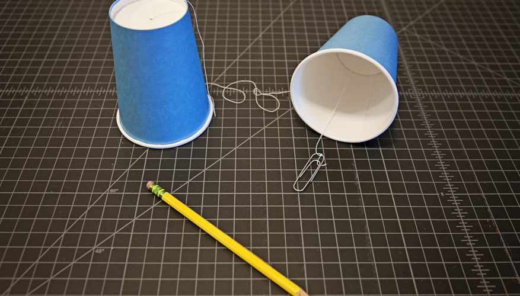

# Aligned Circular Buffer



Aligned circular buffer is a lightweight templated circular buffer class
that utilizes contiguous blocks of memory to store objects to be used
with a single producer, single consumer communication model.

## Usage

To use in your own project clone this repo, link its path in your project
search directory, and include the header file _aligned_circular_buffer.hpp_.

I've designed it with simple aligned C++ structs in mind:

```cpp
/*
 * A stand in basic message with 8 fields, aligned to 64 bytes.
 */
using align_t = std::uint64_t;
struct alignas(64) test_message
{
  align_t field_0{0};
  align_t field_1{0};
  align_t field_2{0};
  align_t field_3{0};
  align_t field_4{0};
  align_t field_5{0};
  align_t field_6{0};
  align_t field_7{0};
};
```

The above message, used with an aligned circular buffer, can reduce cache
eviction by accounting for the alignment of the size of a cache's blocks.
(64 Bytes is quite common--you can be sure it will always be a power of two).

After defining a given message, such as the one above, and importing the
single header file you can begin using it in a straight forward manner:

```cpp
#include <thread>

void producer(aligned_circular_buffer& buffer)
{
  int x = 0;
  while (x < 10)
    buffer.push_back(x);
}

void consumer(aligned_circular_buffer& buffer)
{
  int received;
  while (recieved < 10)
  {
    if (!buffer.empty())
    {
      received = buffer.pop_front();
      std::cout << "received new message: " << received << std::endl;
    }
  }
}

int main()
{
  aligned_circular_buffer<int, 16> buffer;
  std::thread producer_thread(producer, &buffer);
  std::thread consumer_thread(consumer, &buffer);

  producer_thread.join();
  consumer_thread.join();
}

```

The above program uses a producer that pushes a series of integers onto
the aligned circular buffer. In a separate process, the consumer checks
if there is a new message to inspect and pops it from the buffer and
prints it to standard output if so. If the aligned circular buffer were
smaller, say size 4, and the consumer were not quick enough in its checking
and removing messages, the producer would overwrite the oldest messages
in the buffer as new messages are produced.

## Tests

Unit tests are located in the test directory. There's a few demonstrating
essential functionality, but more extensive tests may be added.


